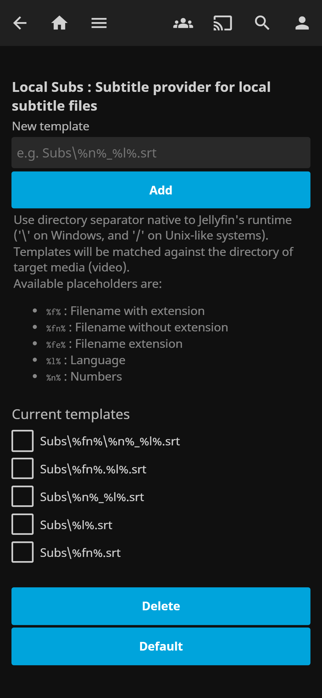

# Local Subs

Subtitle provider plugin for local subtitle files on Jellyfin. Jellyfin by default has a fixed path on detecting subtitle files (srt files, etc.).

This plugin enables importing subtitles from a different path (e.g. in a `Subs` directory on the media path) by letting library owners to specify where to find subtitles local to the media (video) path via templates.

Templates supports placeholders like filename and language to add a degree of freedom on matching subtitles. For example, a t template of `Subs\%fn%.%l%.srt` will match to `Subs\My.Home.Video.2023.Spanish.srt` for media `My.Home.Video.2023.mp4`. The `%l%` placeholder will match for 3 variants of language names, the two letter (e.g. `es` for Spanish), three letter (e.g. `spa` for Spanish) and english name (e.g. `Spanish` for Spanish).

Available placeholders are:
* `%f%` : Filename with extension
* `%fn%` : Filename without extension
* `%fe%` : Filename extension
* `%l%` : Language
* `%n%` : Any arbitrary number

## Installation

### Add repository

The plugin can be installed using a custom plugin repository hosted on Github. This is only done once. To add this repository, follow these steps:

1. Open Jellyfin admin dashboard and navigate to `Plugins`.
2. Select `Repositories` tab.
3. Click the plus "+" symbol to add a repository.
4. Enter `Local Subs` as the repository name.
5. Enter `https://azam.github.io/jellyfin-plugin-localsubs/repository.json` as the repository url.
6. Click `Save`.

### Install/update plugin

To install or update the plugin, follow these steps:

1. Open Jellyfin admin dashboard and navigate to `Plugins`.
2. Select `Catalog` tab.
3. Under `Metadata`, select `Local Subs`.
4. _Optional:_ Select the desired plugin version.
5. Click `Install`.
6. Restart Jellyfin server.

## Usage

This plugins depends on a set of string templates to find the desired subtitles. You must define the string templates on the plugin settings page before using it.

### Configure templates

1. Open Jellyfin admin dashboard and navigate to `Plugins`.
2. Select `Local Subs`.
3. _Optional_: Add new template.
    1. Type a new template on `New template` text input.
    2. Click `Add`.
4. _Optional_: Delete existing template.
    1. Select templates to delete.
    2. Click `Delete`.
5. _Optional_: Set default templates. (This will override the current templates)
    1. Click `Default`.
4. _Optional:_ Rescan your library to reflect the changes.

## Screenshot

## Development

DotNet SDK and an editor is the minimum requirement for development.

VS Code launch settings are included to debug the plugin on Jellyfin. Debugging requires a pre-built Jellyfin server and web app. Web app build requires node as well. Simple preparation Powershell script [prepare.ps1](prepare.ps1) is also provided to download and build Jellyfin for debugging purposes.

Other instructions, please refer to development instructions at [jellyfin-plugin-template](https://github.com/jellyfin/jellyfin-plugin-template) for detailed steps.

## License

[GPLv3](LICENSE)

## Author

Azamshul Azizy <azamshul@gmail.com>
